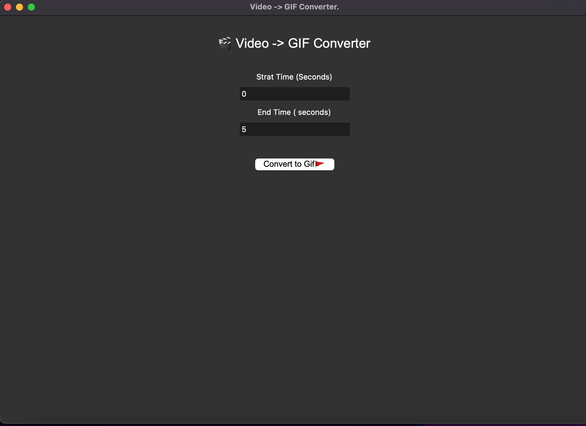

# 🎬 Video To GIF Converter


A simple and powerful desktop application that converts video files into animated GIF images.

This project is built with Python and provides a user-friendly graphical interface where users can select a video, choose a specific time range, and export the selected part as a GIF file.

---

# 🖼️ Application Preview



Place your application screenshot here:

```
assets/screenshot.png
```

---

# 📌 About The Project

**Video To GIF Converter** is a lightweight Python desktop tool designed to make GIF creation easier.

Instead of using complicated video editing software, users can quickly:

- Select a video file
- Choose the beginning and ending time
- Convert the selected part into a GIF
- Save the final animation

The application is suitable for beginners, developers, content creators, and anyone who needs a simple video-to-GIF converter.

---

# ✨ Features

## 🎥 Video Processing

- Convert videos into GIF format
- Supports common video extensions:

```
.mp4
.mov
.mkv
.avi
```

---

## ⏱️ Time Selection

Users can control which part of the video should become a GIF.

Example:

```
Video length: 60 seconds

Start:
10 seconds

End:
20 seconds
```

Result:

Only the 10-second section will be converted.

---

## 🖥️ Simple GUI

The application uses Tkinter to create a clean graphical interface.

The interface includes:

- Application title
- Start time input
- End time input
- Convert button
- Status message

No command line knowledge is required.

---

# 🛠️ Technologies

## Python

Main programming language used to build the application.

---

## Tkinter

Python's built-in GUI library.

Used for:

- Creating windows
- Buttons
- Text fields
- Labels
- File selection dialogs

---

## MoviePy

Used for video processing.

Responsibilities:

- Loading video files
- Cutting video clips
- Extracting frames

Example:

```python
clip = VideoFileClip(video_path)

gif_clip = clip.subclipped(
    start,
    end
)
```

---

## ImageIO

Used to create the final GIF animation.

Example:

```python
imageio.mimsave(
    output_path,
    frames,
    duration=0.1
)
```

---

# 📦 Installation Guide

## 1. Install Python

Make sure Python is installed:

```bash
python3 --version
```

Example:

```
Python 3.12.x
```

---

## 2. Download The Project

Clone the repository:

```bash
git clone https://github.com/yourusername/video-to-gif-converter.git
```

Enter the project folder:

```bash
cd video-to-gif-converter
```

---

## 3. Install Required Libraries

Install dependencies:

```bash
pip install moviepy imageio
```

or:

```bash
python3 -m pip install moviepy imageio
```

---

# ▶️ Running The Application

Start the program:

```bash
python3 converter.py
```

The application window will appear.

---

# 📖 User Guide

## Step 1

Click the video selection button.

Choose your video file.

Example:

```
example.mp4
```

---

## Step 2

Enter the starting point.

Example:

```
Start Time:
0
```

Meaning:

The GIF starts from the beginning.

---

## Step 3

Enter the ending point.

Example:

```
End Time:
5
```

Meaning:

The GIF will contain the first 5 seconds.

---

## Step 4

Click:

```
Convert to GIF 🚩
```

---

## Step 5

Choose the output location.

Example:

```
my_animation.gif
```

---

# 📂 Project Structure

```
Video-To-GIF-Converter/

│
├── converter.py
│
├── README.md
│
└── assets/
    │
    └── screenshot.png
```

---

# 🧠 How The Program Works

The application follows this process:

```
User selects video
        |
        ↓
MoviePy loads video
        |
        ↓
User chooses time range
        |
        ↓
Frames are extracted
        |
        ↓
ImageIO creates GIF
        |
        ↓
GIF file is saved
```

---

# 🔍 Code Explanation

## Selecting Video

The program opens a file dialog:

```python
filedialog.askopenfilename()
```

This allows the user to choose a video file.

---

## Creating Video Clip

MoviePy loads the selected video:

```python
clip = VideoFileClip(video_path)
```

---

## Cutting The Video

Only the selected part is used:

```python
gif_clip = clip.subclipped(start,end)
```

---

## Extracting Frames

The video is converted into images:

```python
for frame in gif_clip.iter_frames(fps=10):
    frames.append(frame)
```

---

## Saving GIF

ImageIO combines frames:

```python
imageio.mimsave(
    output_path,
    frames,
    duration=0.1
)
```

---

# ⚠️ Troubleshooting

## Error:

```
ModuleNotFoundError: No module named 'moviepy'
```

Solution:

```bash
pip install moviepy
```

---

## GIF Quality Is Low

Increase FPS:

Change:

```python
fps=10
```

to:

```python
fps=20
```

Higher FPS means smoother GIF but larger file size.

---

## Large GIF File

Reduce:

- Video duration
- FPS
- Resolution

---

# 🚧 Future Improvements

Planned features:

- Modern UI design
- Drag and drop videos
- GIF quality settings
- Video preview
- Progress bar
- Dark mode
- Multiple language support
- Export settings

---

# 🤝 Contribution

Contributions are welcome.

You can:

- Report bugs
- Suggest features
- Improve the code
- Create pull requests

---

# 👨‍💻 Author

**Aiden**

Python Developer

Interested in:

- Artificial Intelligence
- Software Development
- Game Development
- Automation Tools

---

# 📄 License

This project is licensed under the MIT License.

You are free to use, modify, and distribute this project.
